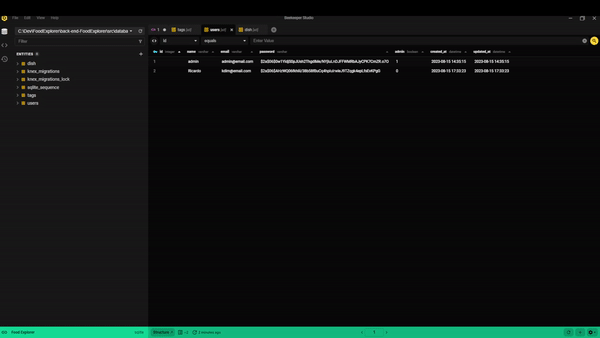
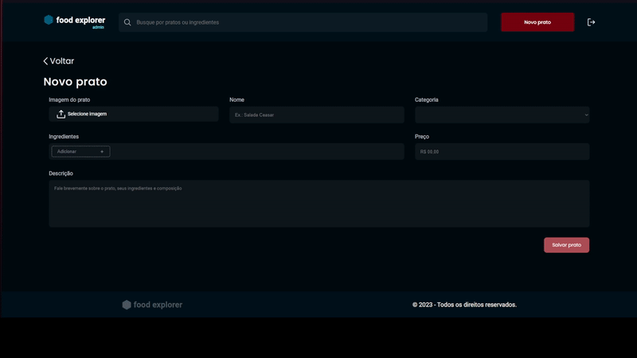
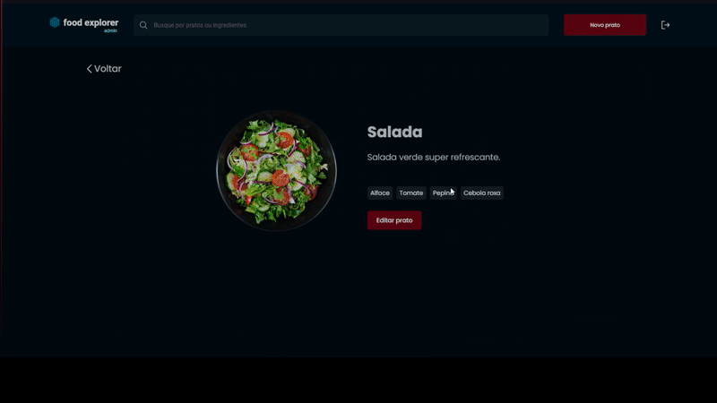
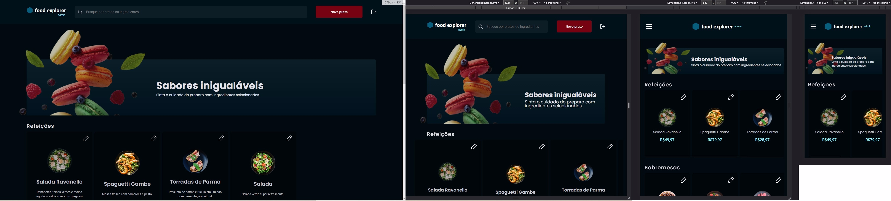

  
    

    Back-end do desafio final do curso Explorer da Rocketseat, sendo criado com SQL, Knex.js e Express.js.
    Visualização disponível em: https://ricardoadamefoodexplorer.netlify.app 
    Sinta-se à vontade para testar com a função de admin: 
    email: admin@email.com senha: 123

  

### Funcionalidades
As funcionalidades de: criar, excluir e editar pratos estão disponíveis para o admin. Busca por ingredientes e pratos disponível para ambos usuário e admin.

  

  

### Layout e Componentes Responsivos

    

O código front-end está disponível em: https://github.com/kdimsan/front-end-FoodExplorer

Caso deseja fazer um pull do projeto, basta rodar npm install tanto no front-end quanto no back-end e alterar a rota da api para onde está localizado o servidor do 
back-end.
